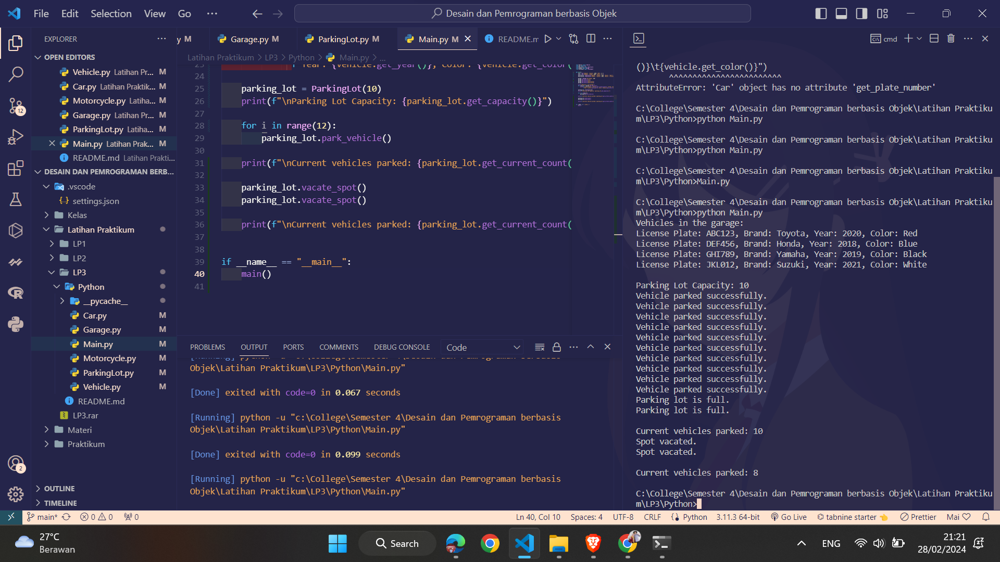
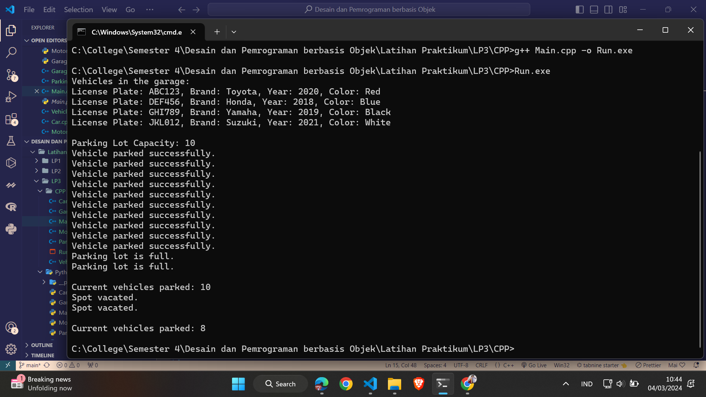

# Latihan Praktikum 4 DPBO 2024

## Janji

Bismillah
Saya Themy Sabri Syuhada dengan NIM 2203903. Demi keberkahan-Nya, saya berjanji mengerjakan latihan praktikum 4 DPBO dengan jujur dan tidak melakukan kecurangan seperti yang telah dispesifikasikan.
Aamiin.

## Deskripsi Program

Program ini terdiri dari beberapa kelas yang saling berhubungan untuk menciptakan sistem manajemen kendaraan. Berikut adalah gambaran umum tentang bagaimana program ini berfungsi:

1. Kelas Vehicle
   Kelas ini bertanggung jawab untuk merepresentasikan sebuah kendaraan.
   Setiap kendaraan memiliki beberapa atribut seperti nomor plat, merek, tahun pembuatan, dan warna.
   Kelas ini menyediakan metode untuk mengakses dan mengatur nilai dari setiap atributnya.

2. Kelas Garage
   Kelas ini merepresentasikan sebuah garasi yang dapat menyimpan beberapa kendaraan.
   Setiap garasi memiliki nama dan luas area.
   Garasi dapat menambahkan kendaraan ke dalamnya.
   Kelas ini juga menyediakan metode untuk mengakses dan mengatur informasi tentang garasi, seperti nama dan luas area.

3. Kelas ParkingLot
   Kelas ini merepresentasikan sebuah tempat parkir dengan kapasitas tertentu.
   Tempat parkir memiliki fungsi untuk memarkir kendaraan dan mengosongkan tempat parkir.
   Program akan memberikan pesan jika tempat parkir penuh saat mencoba untuk memarkir kendaraan.
   Kelas ini menyediakan metode untuk mengakses informasi tentang jumlah kendaraan yang terparkir dan kapasitas total tempat parkir.

4. Kelas VehicleTable
   Kelas ini bertanggung jawab untuk menampilkan data kendaraan dalam bentuk tabel yang dinamis.
   Tabel yang ditampilkan akan menyesuaikan lebar kolomnya berdasarkan panjang data yang ada di dalam list kendaraan.
   Setiap sel dalam tabel memiliki garis pembatas untuk membedakan antara header dan data.
   Kelas ini menyediakan metode untuk menampilkan tabel kendaraan dengan informasi yang ada.

5. Kelas Car
   Kelas ini mewakili jenis kendaraan mobil.
   Selain atribut yang diwarisi dari kelas Vehicle, kelas Car memiliki atribut tambahan seperti jumlah kursi dan jumlah pintu mobil.
   Metode getter dan setter disediakan untuk mengakses dan mengatur informasi tambahan yang unik untuk mobil, seperti jumlah kursi dan jumlah pintu.

6. Kelas Motorcycle
   Kelas ini mewakili jenis kendaraan sepeda motor.
   Selain atribut yang diwarisi dari kelas Vehicle, kelas Motorcycle memiliki atribut tambahan seperti tipe sepeda motor dan kapasitas tangki bahan bakar.
   Metode getter dan setter disediakan untuk mengakses dan mengatur informasi tambahan yang unik untuk sepeda motor, seperti tipe sepeda motor dan kapasitas tangki bahan bakar.

## Alur Program

1. Inisialisasi Kendaraan
   Program dimulai dengan membuat beberapa objek kendaraan, baik mobil maupun sepeda motor, dengan memberikan detail seperti nomor plat, merek, tahun pembuatan, dan warna.
   Objek-objek ini kemudian disimpan dalam sebuah struktur data, seperti vektor atau list, untuk kemudian dimasukkan ke dalam garasi.

2. Garasi Kendaraan
   Setelah kendaraan dibuat, program membuat sebuah objek garasi dengan memberikan nama dan luas area.
   Objek kendaraan yang telah dibuat kemudian dimasukkan ke dalam garasi menggunakan metode add_vehicle() dari kelas Garage.

3. Tampilan Kendaraan dalam Garasi
   Setelah kendaraan dimasukkan ke dalam garasi, program menampilkan informasi tentang kendaraan yang ada di dalam garasi.
   Hal ini dilakukan dengan menggunakan objek dari kelas VehicleTable, yang bertanggung jawab untuk menampilkan informasi kendaraan dalam bentuk tabel yang dinamis.

4. Manajemen Tempat Parkir
   Selanjutnya, program membuat objek tempat parkir dengan kapasitas tertentu.
   Program mencoba untuk memarkir kendaraan lebih dari kapasitas tempat parkir yang tersedia untuk menguji fungsionalitas dari kelas ParkingLot.
   Pesan yang sesuai akan ditampilkan jika tempat parkir penuh atau jika kendaraan berhasil diparkir.

5. Pembebasan Memori
   Setelah selesai digunakan, memori untuk objek yang dialokasikan secara dinamis dibersihkan dengan menghapus objek yang dibuat menggunakan operator delete.

## Screenshots

### Python

### C++

